# ComfyUI-QwenImage-PhotoStyles

A single ComfyUI node — **PE-T2I Photo Style Prompt** — that turns a short prompt into a
rich, styled one for **Qwen-Image-2.1**.

Pick a **photographic style** from a dropdown (17 styles), type a short prompt, and the node
sends it to a **PE-T2I rewriter** (any OpenAI-compatible endpoint) together with that style's
sheet. It returns a long English prompt, a matching **negative prompt**, and the **width /
height** for the aspect ratio the rewriter chose.

Each style is described as **camera language + mood** — never a photographer's name. Your
subject, and whatever text / counts / colours / positions you specify, stay yours; the style
only decides what you left open. The shorter your prompt, the more the style shows through.

> **This is not a model loader.** It only produces text (prompt / negative) and two integers
> (width / height). It has nothing to do with GGUF / NVFP4 / fp8 / bf16 — those only matter for
> the loader nodes downstream. Use it with any Qwen-Image-2.1 setup, in any format.

## Where this node sits

It stands **at the very front** and only shapes text: it takes your short line + the chosen
style, has the PE-T2I rewriter expand it, and hands the finished prompt / negative / size to the
ordinary Qwen-Image-2.1 nodes. It never loads a model or touches a pixel — think of it as the
*art director* that writes the shot; the camera (the DiT) takes it.

```
   your short line   +   style dropdown
              |
              v
 +--------------------------------------+
 |   PE-T2I Photo Style Prompt  (THIS)  |   <- text only, seconds, no VRAM
 |   short line + style sheet --> PE-T2I |
 |   out: long prompt . negative . size |
 +--------------------------------------+
     | prompt / negative        | width / height
     v                          v
 TextEncodeQwenImage21      EmptyLatentImage
     |  (encode -> cond)         | (make canvas)
     +---------->  KSampler (DiT denoise)  <--------+
                        |
                        v
                    VAEDecode  -->  final image
```

## Gallery

**Every image below is the whole prompt you write** — pick a style, type one short line like the
caption, and this is what comes out. Two photos and two "posters" per style; nothing was
hand-tuned. (Generated with this node on a quantized Qwen-Image-2.1 setup.)

### Black Fury

<table>
<tr>
<td width="25%" valign="top">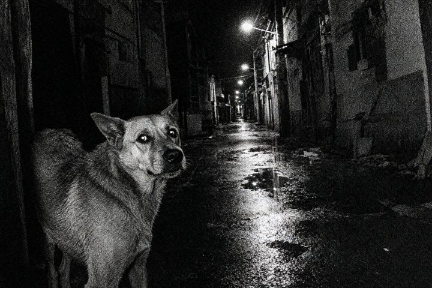<br><sub><code>photo</code> <i>&ldquo;a stray dog snaps its head around in a pitch-black alley after midnight rain&rdquo;</i></sub></td>
<td width="25%" valign="top">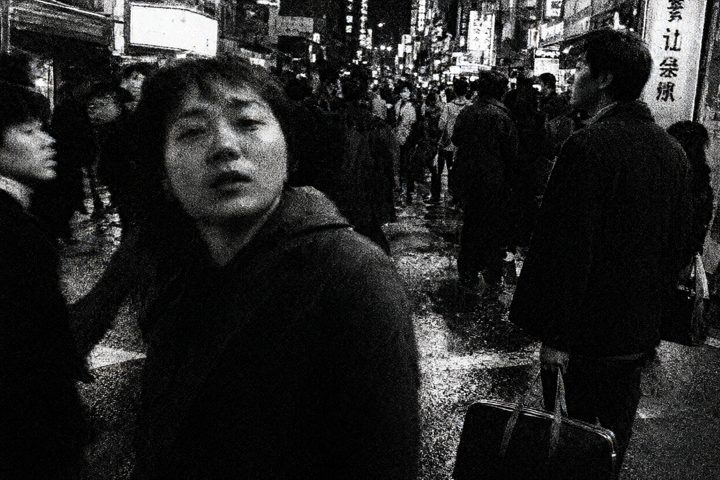<br><sub><code>photo</code> <i>&ldquo;a blurred face lurches toward the camera through a dense crowd under harsh neon&rdquo;</i></sub></td>
<td width="25%" valign="top">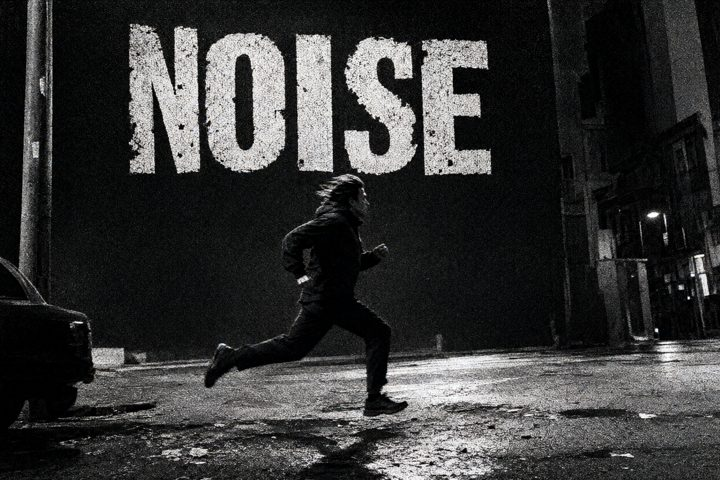<br><sub><code>poster</code> <i>&ldquo;a gritty B&W gig poster, huge distressed title “NOISE”, a blurred running figure&rdquo;</i></sub></td>
<td width="25%" valign="top">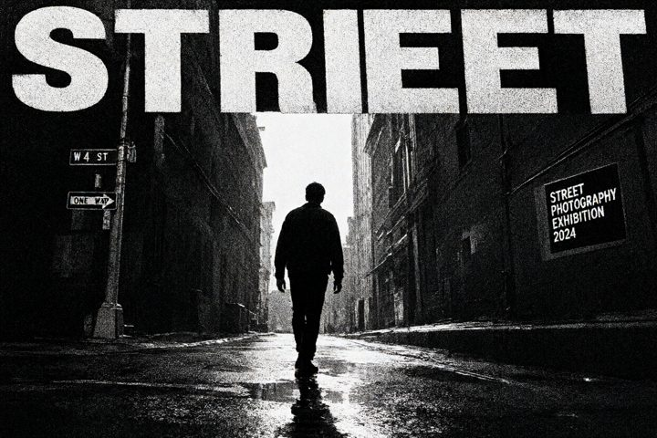<br><sub><code>poster</code> <i>&ldquo;a B&W street-photography exhibition poster, bold title “STREET”, a lone backlit figure&rdquo;</i></sub></td>
</tr>
</table>

### Geometry of Light

<table>
<tr>
<td width="25%" valign="top">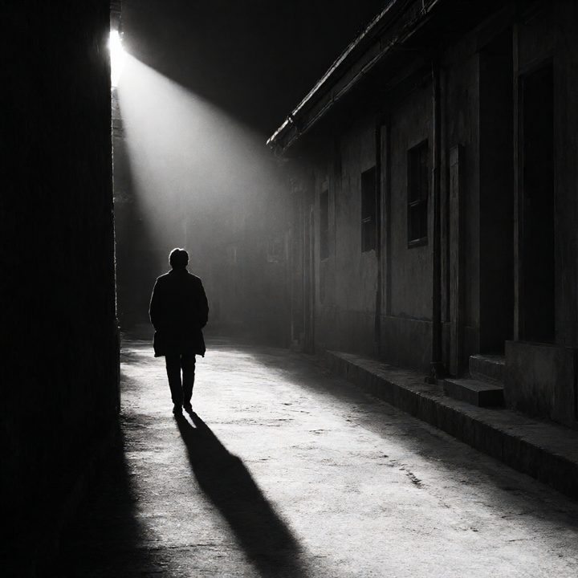<br><sub><code>photo</code> <i>&ldquo;a Tokyo street, hard evening light slicing a narrow alley, a passer-by casting a long shadow (B&W)&rdquo;</i></sub></td>
<td width="25%" valign="top">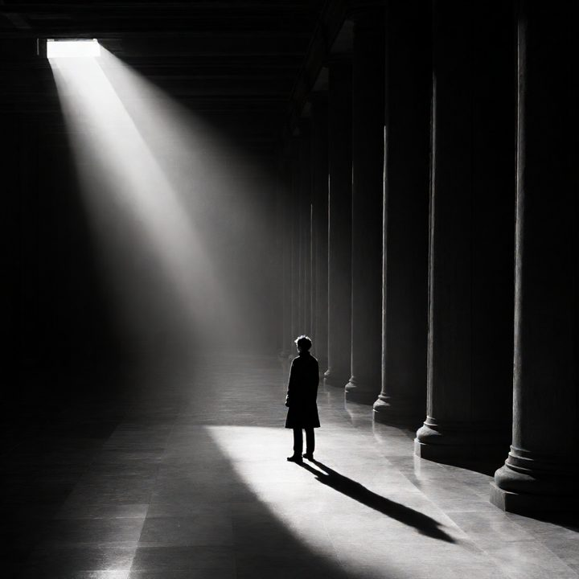<br><sub><code>photo</code> <i>&ldquo;a tiny figure at the end of a long arcade, a blade of light slicing the columns&rdquo;</i></sub></td>
<td width="25%" valign="top">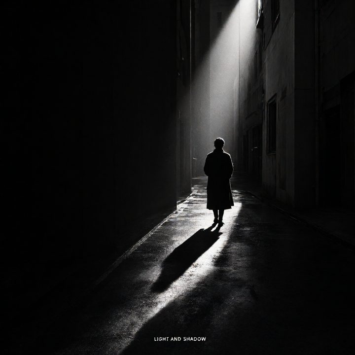<br><sub><code>poster</code> <i>&ldquo;a minimalist B&W exhibition poster, a Tokyo-street beam and long shadows, title “LIGHT AND SHADOW”&rdquo;</i></sub></td>
<td width="25%" valign="top">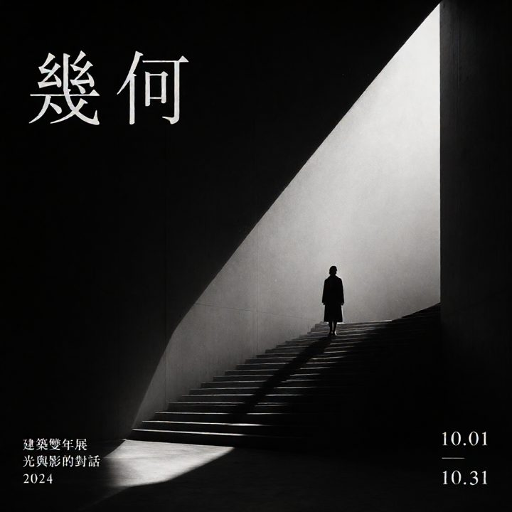<br><sub><code>poster</code> <i>&ldquo;an architecture-biennale poster, a beam and long shadows, title “Geometry”&rdquo;</i></sub></td>
</tr>
</table>

### Warm Documentary

<table>
<tr>
<td width="25%" valign="top">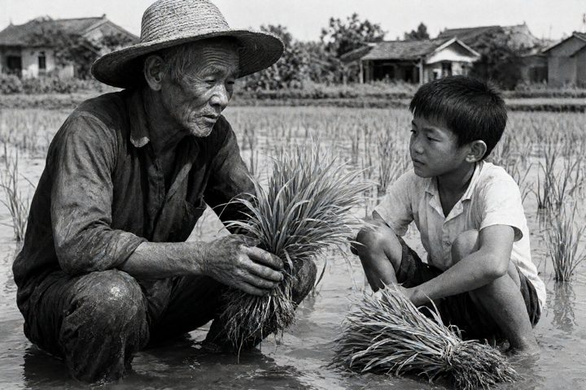<br><sub><code>photo</code> <i>&ldquo;a farmer’s rough hands cupping seedlings, a child watching at the field’s edge&rdquo;</i></sub></td>
<td width="25%" valign="top">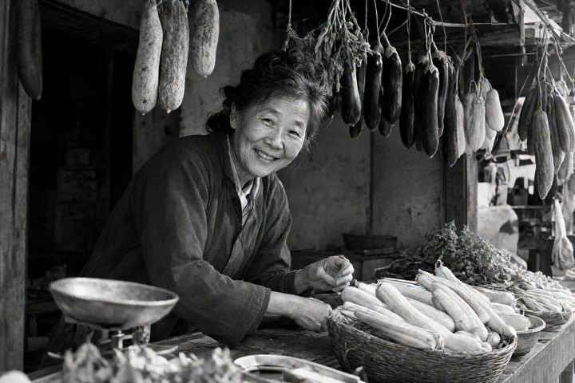<br><sub><code>photo</code> <i>&ldquo;an old stall-keeper laughing among hanging vegetables under market lamplight&rdquo;</i></sub></td>
<td width="25%" valign="top">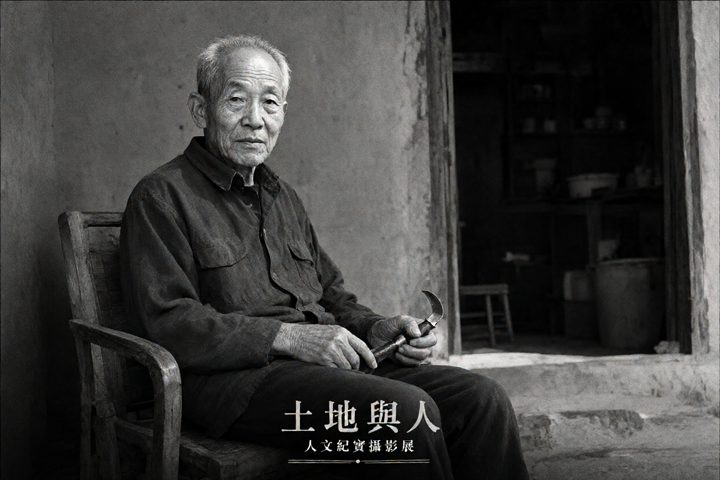<br><sub><code>poster</code> <i>&ldquo;a humanist documentary exhibition poster, a warm B&W portrait, title “Land and People”&rdquo;</i></sub></td>
<td width="25%" valign="top">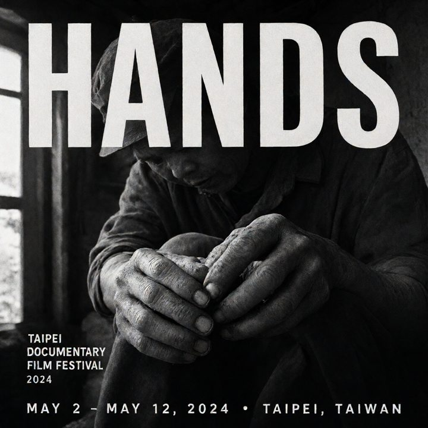<br><sub><code>poster</code> <i>&ldquo;a documentary film-festival poster, a close-up of working hands, title “HANDS”&rdquo;</i></sub></td>
</tr>
</table>

### White Leap

<table>
<tr>
<td width="25%" valign="top">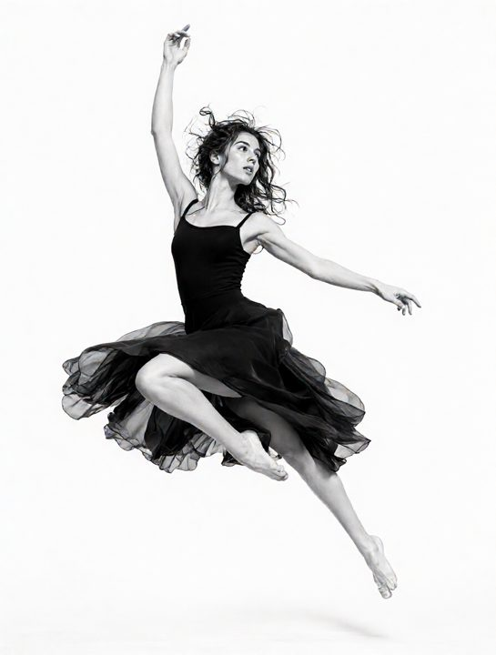<br><sub><code>photo</code> <i>&ldquo;a dancer frozen at the peak of a leap, full body on pure white&rdquo;</i></sub></td>
<td width="25%" valign="top">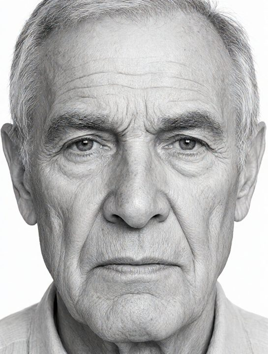<br><sub><code>photo</code> <i>&ldquo;an extreme close-up of a deeply lined face, every pore sharp, eyes on the lens&rdquo;</i></sub></td>
<td width="25%" valign="top">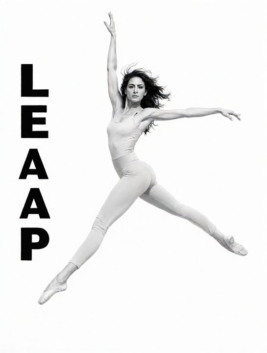<br><sub><code>poster</code> <i>&ldquo;a pure-white minimalist fashion poster, a leaping dancer, vertical title “LEAP”&rdquo;</i></sub></td>
<td width="25%" valign="top">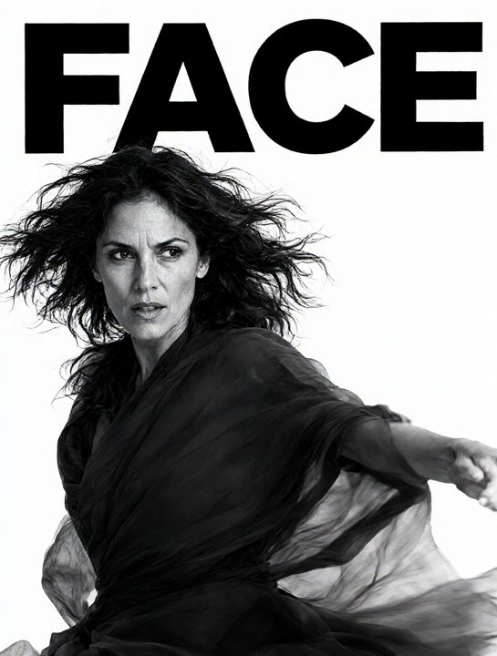<br><sub><code>poster</code> <i>&ldquo;a B&W portrait-show poster, white ground, a razor-sharp face, title “FACE”&rdquo;</i></sub></td>
</tr>
</table>

### Corner Elegance

<table>
<tr>
<td width="25%" valign="top">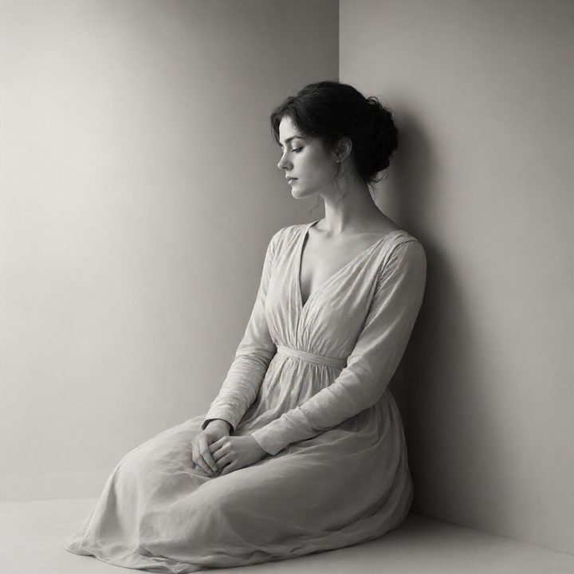<br><sub><code>photo</code> <i>&ldquo;a woman folded elegantly into a bare studio corner, hands quietly clasped&rdquo;</i></sub></td>
<td width="25%" valign="top">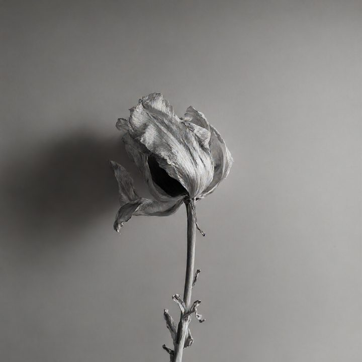<br><sub><code>photo</code> <i>&ldquo;a single wilting tulip against a smooth grey seamless ground&rdquo;</i></sub></td>
<td width="25%" valign="top">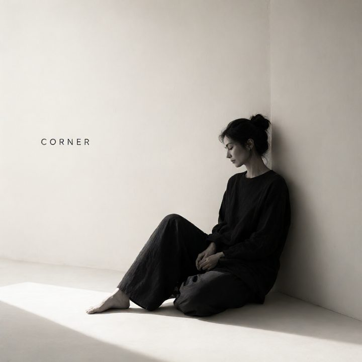<br><sub><code>poster</code> <i>&ldquo;a minimalist gallery poster, lots of white space, a quiet corner figure, title “CORNER”&rdquo;</i></sub></td>
<td width="25%" valign="top">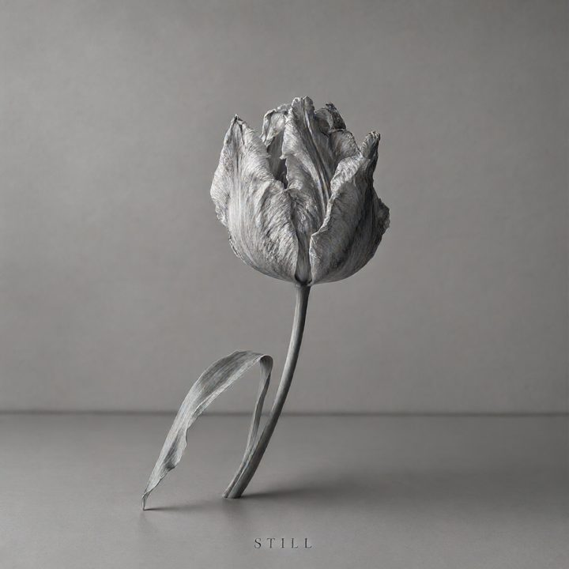<br><sub><code>poster</code> <i>&ldquo;a still-life photobook poster, grey ground with a wilting tulip, title “STILL”&rdquo;</i></sub></td>
</tr>
</table>

### Cold Power

<table>
<tr>
<td width="25%" valign="top">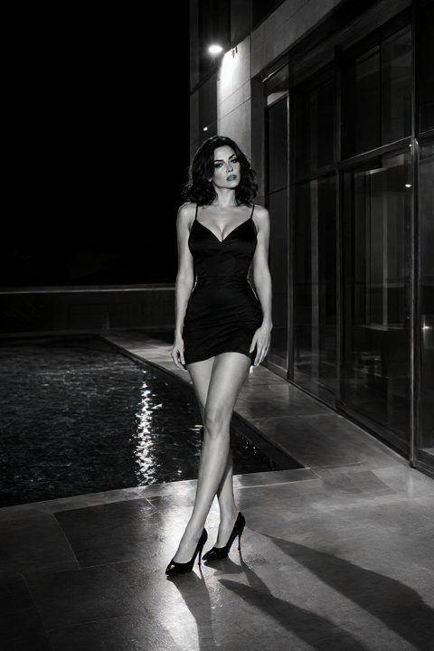<br><sub><code>photo</code> <i>&ldquo;a commanding woman in heels, full figure, at the edge of a floodlit midnight pool&rdquo;</i></sub></td>
<td width="25%" valign="top">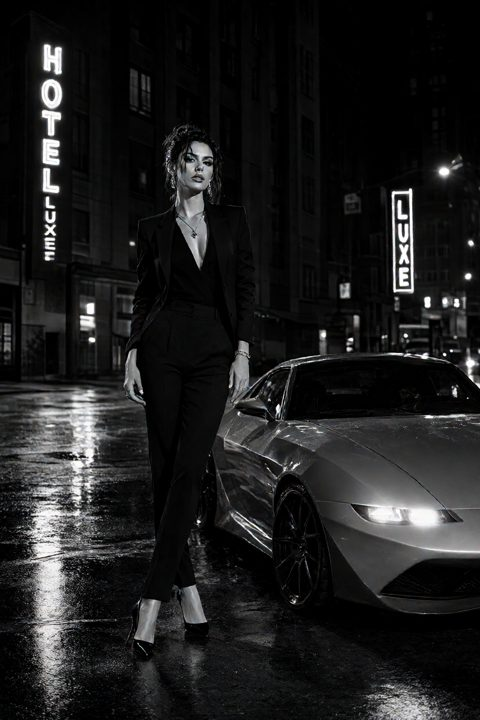<br><sub><code>photo</code> <i>&ldquo;a model leaning coldly against a sports car on a neon-wet street&rdquo;</i></sub></td>
<td width="25%" valign="top">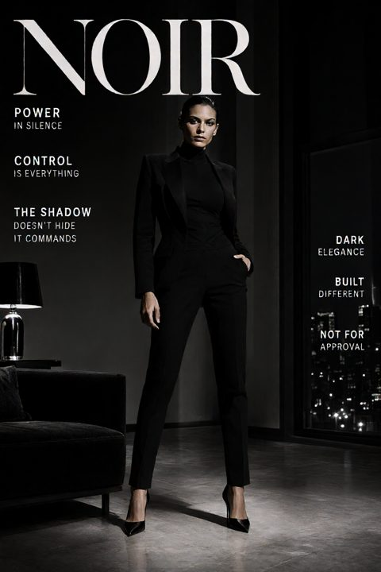<br><sub><code>poster</code> <i>&ldquo;a high-fashion magazine cover, a full-figure power stance, masthead “NOIR”&rdquo;</i></sub></td>
<td width="25%" valign="top">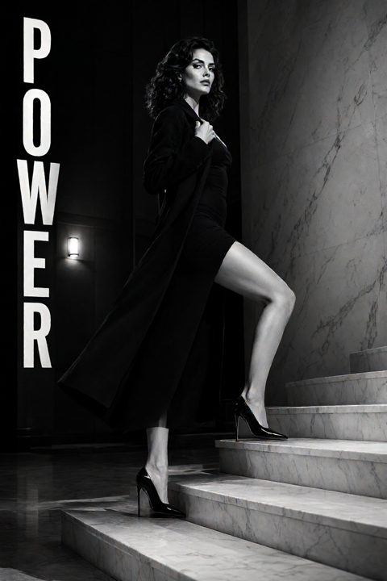<br><sub><code>poster</code> <i>&ldquo;a B&W fashion poster, a woman descending marble stairs, vertical title “POWER”&rdquo;</i></sub></td>
</tr>
</table>

### Hyper Chic East

<table>
<tr>
<td width="25%" valign="top">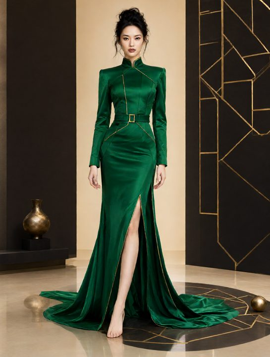<br><sub><code>photo</code> <i>&ldquo;a photorealistic editorial shot, a full-figure model in a sleek contemporary designer gown, power stance&rdquo;</i></sub></td>
<td width="25%" valign="top">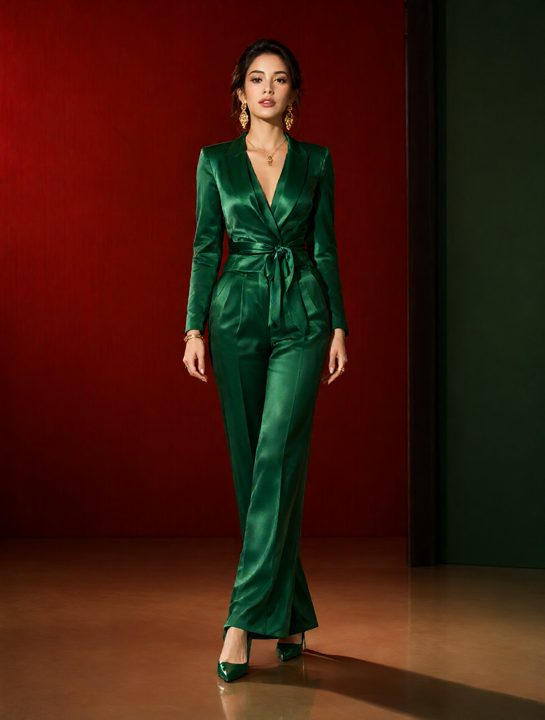<br><sub><code>photo</code> <i>&ldquo;a photorealistic fashion shot, a model in a fitted satin suit, clean studio, jewel-tone backdrop&rdquo;</i></sub></td>
<td width="25%" valign="top">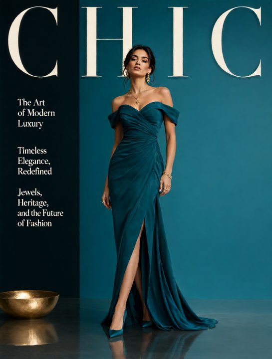<br><sub><code>poster</code> <i>&ldquo;a photoreal fashion magazine cover, a full-figure model in modern haute couture, masthead “CHIC”&rdquo;</i></sub></td>
<td width="25%" valign="top">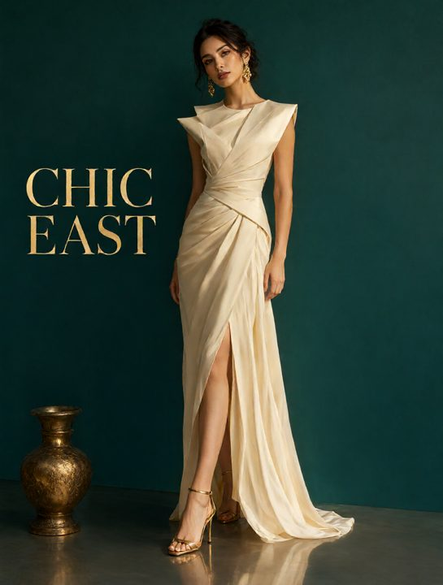<br><sub><code>poster</code> <i>&ldquo;a high-colour fashion poster, a model in a minimal structured gown, side title “CHIC EAST”&rdquo;</i></sub></td>
</tr>
</table>

### Private Diary

<table>
<tr>
<td width="25%" valign="top">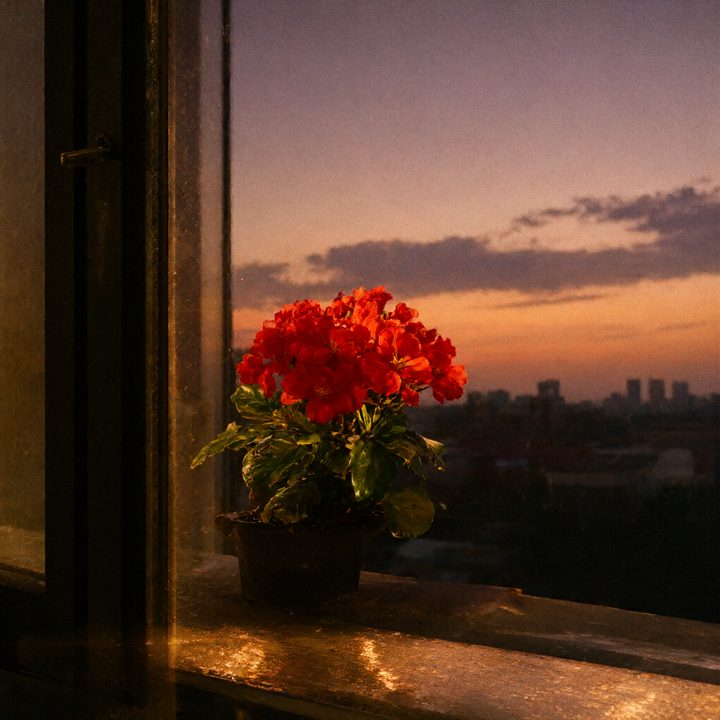<br><sub><code>photo</code> <i>&ldquo;a small bunch of red flowers on a cluttered balcony against a bruised evening sky&rdquo;</i></sub></td>
<td width="25%" valign="top">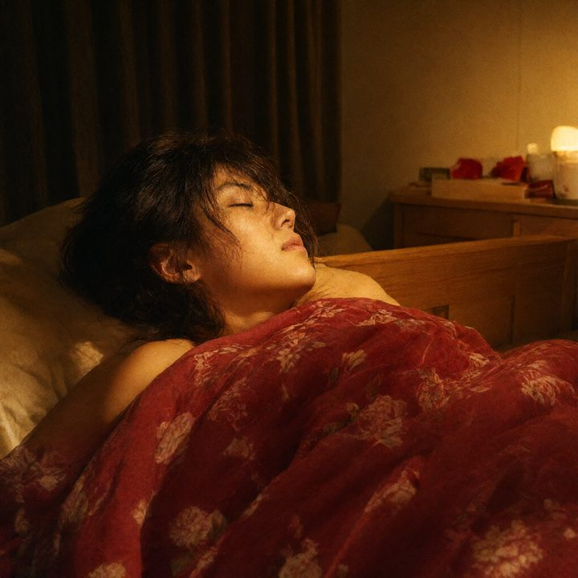<br><sub><code>photo</code> <i>&ldquo;someone just woken, half-wrapped in sheets, lit by a hard close flash&rdquo;</i></sub></td>
<td width="25%" valign="top">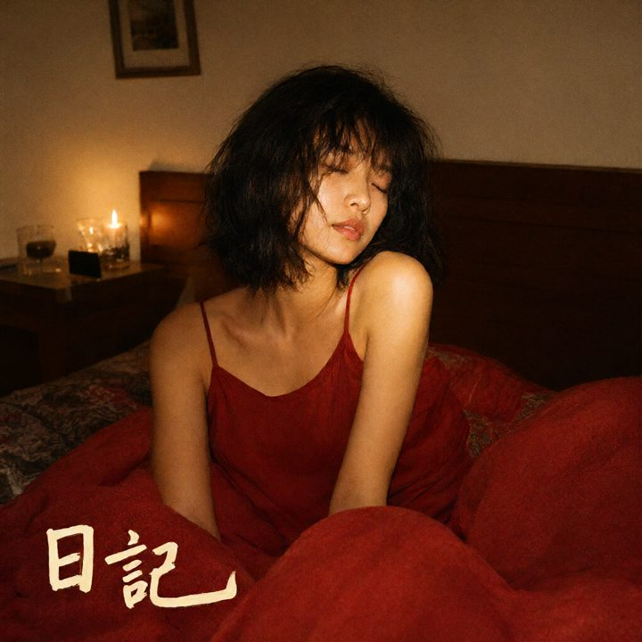<br><sub><code>poster</code> <i>&ldquo;a private-snapshot photobook poster, an intimate flash snapshot, title “Diary”&rdquo;</i></sub></td>
<td width="25%" valign="top">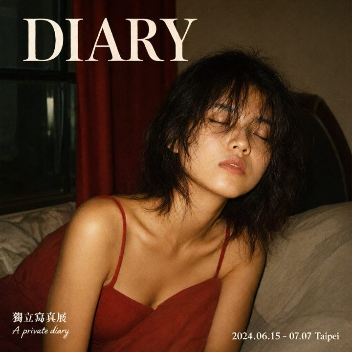<br><sub><code>poster</code> <i>&ldquo;an indie photo-show poster, an overexposed flash close-up, title “DIARY”&rdquo;</i></sub></td>
</tr>
</table>

### Color Behind Glass

<table>
<tr>
<td width="25%" valign="top">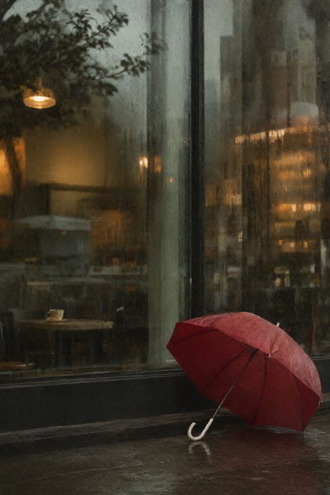<br><sub><code>photo</code> <i>&ldquo;a lone red umbrella seen through a fogged, rain-streaked café window&rdquo;</i></sub></td>
<td width="25%" valign="top">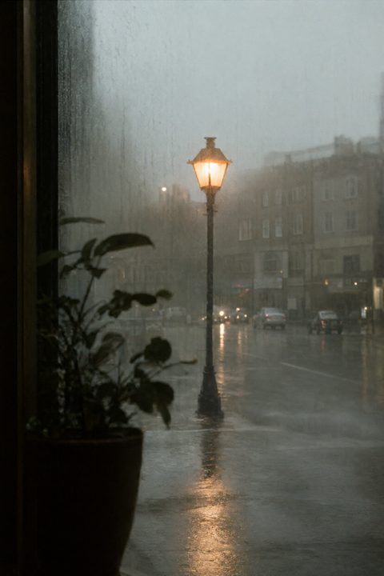<br><sub><code>photo</code> <i>&ldquo;a blurred street reflected in a steamed-up window, one warm light glowing&rdquo;</i></sub></td>
<td width="25%" valign="top">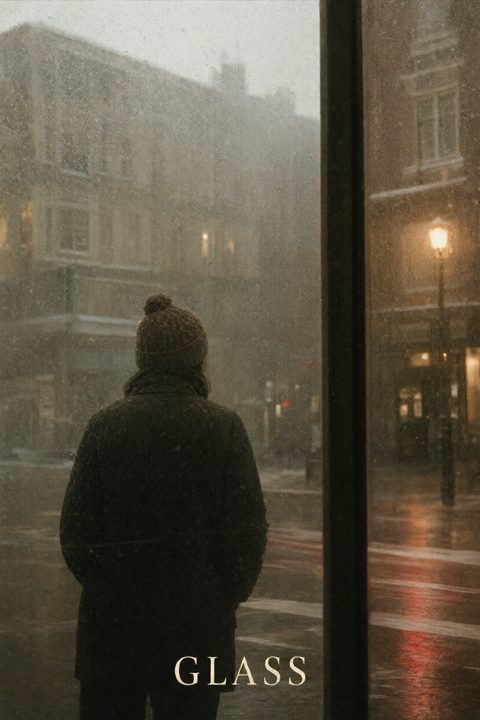<br><sub><code>poster</code> <i>&ldquo;a soft-colour exhibition poster, a blurred street behind a rainy window, title “GLASS”&rdquo;</i></sub></td>
<td width="25%" valign="top">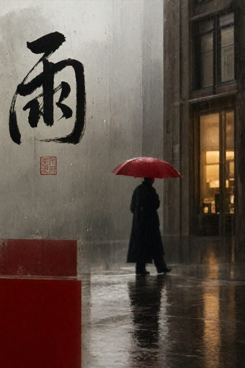<br><sub><code>poster</code> <i>&ldquo;an art-house film poster, a splash of red behind frosted glass, title “Rain”&rdquo;</i></sub></td>
</tr>
</table>

### Frozen Film Still

<table>
<tr>
<td width="25%" valign="top">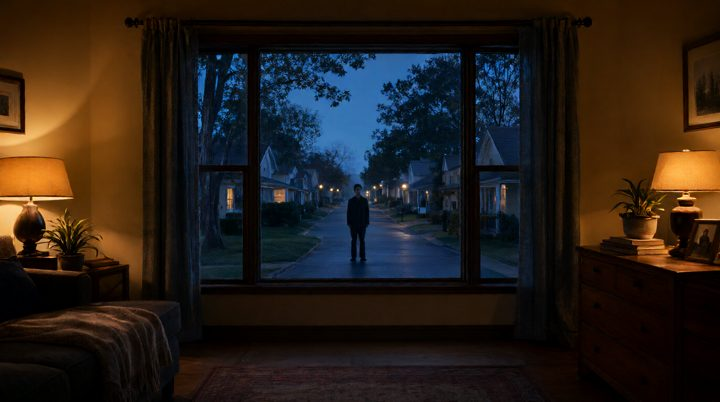<br><sub><code>photo</code> <i>&ldquo;a lone figure standing motionless in an empty suburban street at blue dusk&rdquo;</i></sub></td>
<td width="25%" valign="top">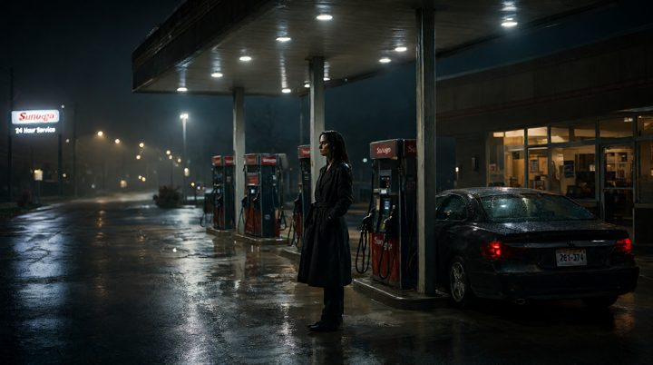<br><sub><code>photo</code> <i>&ldquo;a woman alone under the cold light of a deserted gas station at nightfall&rdquo;</i></sub></td>
<td width="25%" valign="top">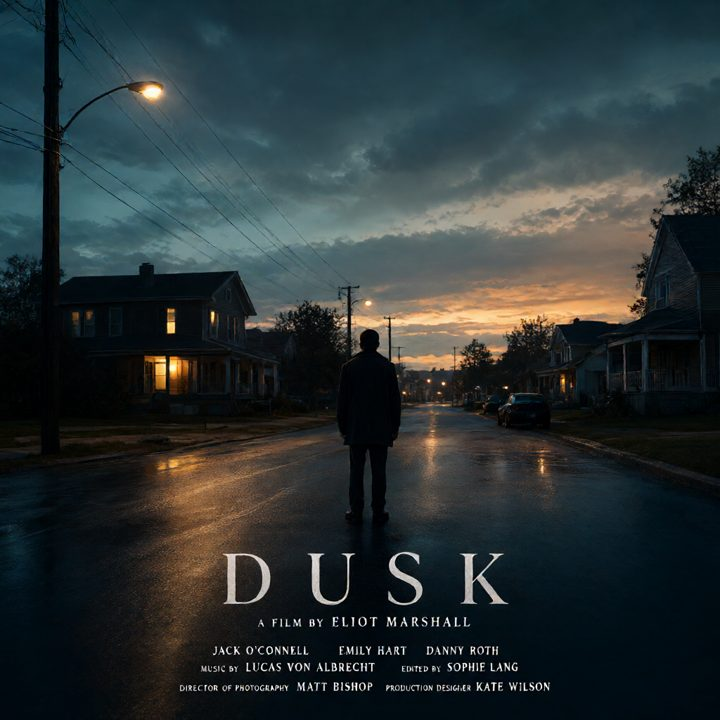<br><sub><code>poster</code> <i>&ldquo;a cinematic poster, a lone figure at blue dusk, film title “DUSK” with small credits&rdquo;</i></sub></td>
<td width="25%" valign="top">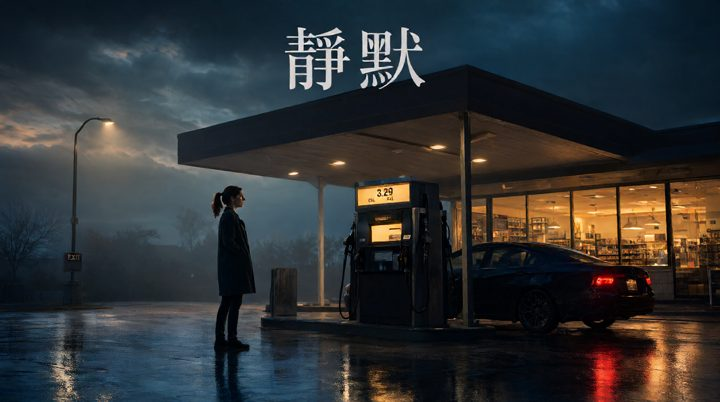<br><sub><code>poster</code> <i>&ldquo;an indie film poster, a lone woman at a cold-lit gas station, title “Silence”&rdquo;</i></sub></td>
</tr>
</table>

### Fairytale Giants

<table>
<tr>
<td width="25%" valign="top">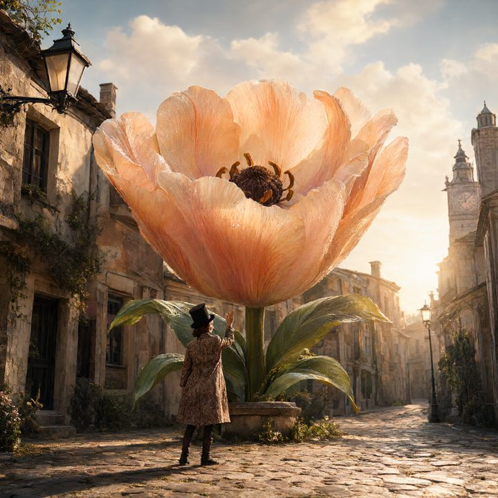<br><sub><code>photo</code> <i>&ldquo;a tiny figure gazing up at a flower taller than a house, petals like parasols&rdquo;</i></sub></td>
<td width="25%" valign="top">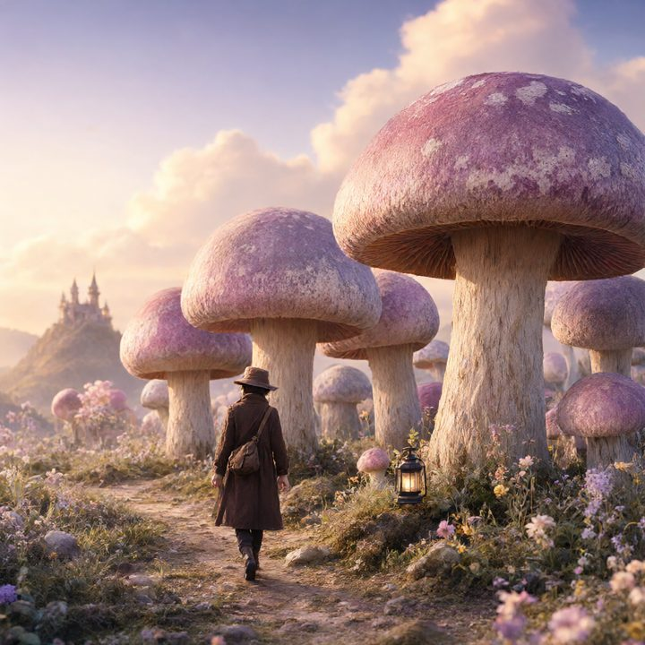<br><sub><code>photo</code> <i>&ldquo;a tiny traveller walking past a row of giant mushrooms on a pastel set&rdquo;</i></sub></td>
<td width="25%" valign="top">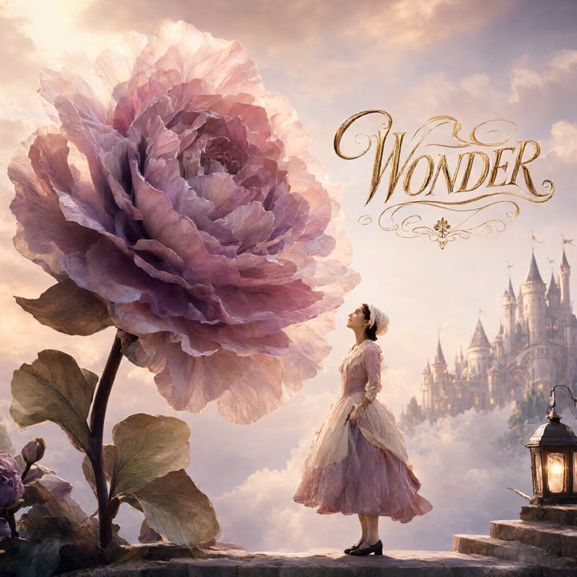<br><sub><code>poster</code> <i>&ldquo;a dreamy fashion-editorial poster, a tiny figure beside a giant flower, title “WONDER”&rdquo;</i></sub></td>
<td width="25%" valign="top">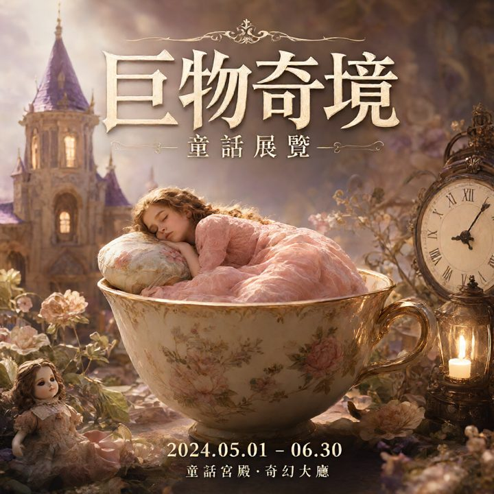<br><sub><code>poster</code> <i>&ldquo;a fairytale-exhibition poster, a giant teacup and a sleeping girl, title “Land of Giants”&rdquo;</i></sub></td>
</tr>
</table>

### Soft Everyday Light

<table>
<tr>
<td width="25%" valign="top">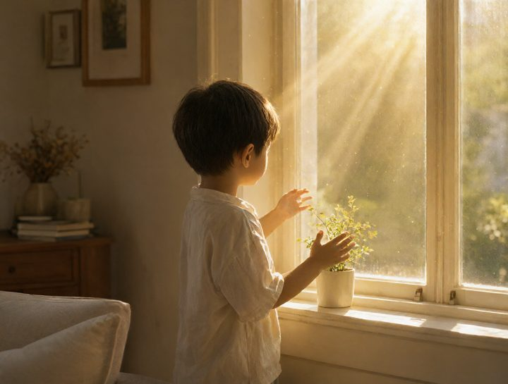<br><sub><code>photo</code> <i>&ldquo;a backlit child in a soft afternoon room, dust drifting in the light&rdquo;</i></sub></td>
<td width="25%" valign="top">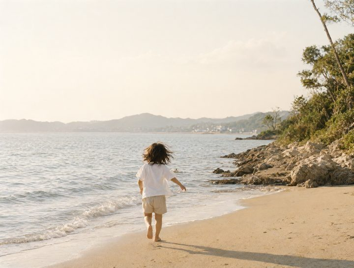<br><sub><code>photo</code> <i>&ldquo;the small back of a child running toward a pale, hazy summer sea&rdquo;</i></sub></td>
<td width="25%" valign="top">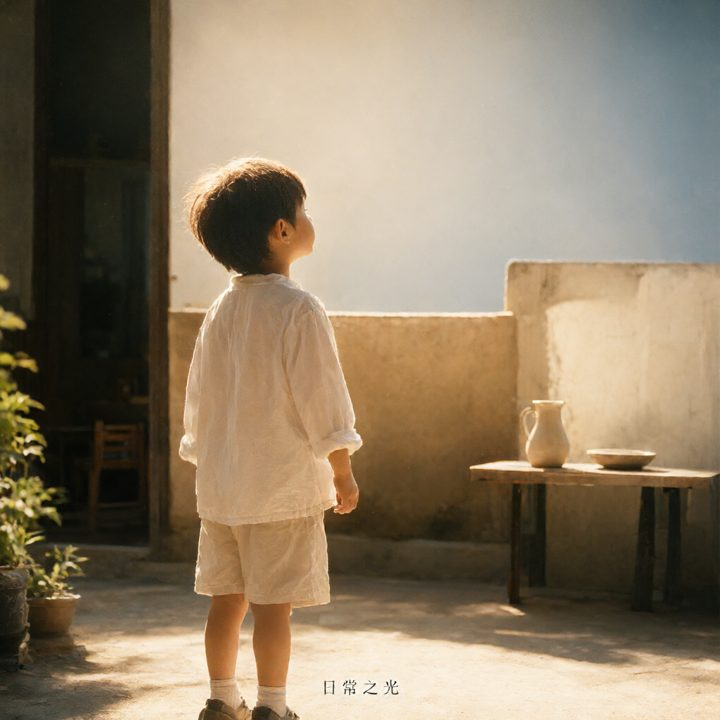<br><sub><code>poster</code> <i>&ldquo;a gentle lifestyle photobook poster, a backlit child and floating dust, title “Everyday Light”&rdquo;</i></sub></td>
<td width="25%" valign="top">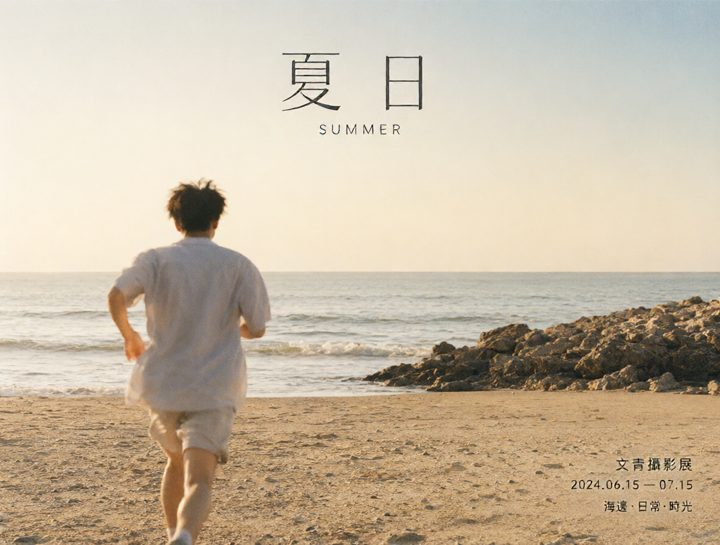<br><sub><code>poster</code> <i>&ldquo;a photo-exhibition poster, a small back running by a hazy sea, title “Summer”&rdquo;</i></sub></td>
</tr>
</table>

### Street in the Mirror

<table>
<tr>
<td width="25%" valign="top">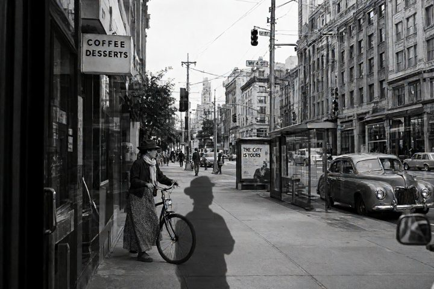<br><sub><code>photo</code> <i>&ldquo;a shop window stacking three layers of reflections, the photographer’s shadow among them&rdquo;</i></sub></td>
<td width="25%" valign="top">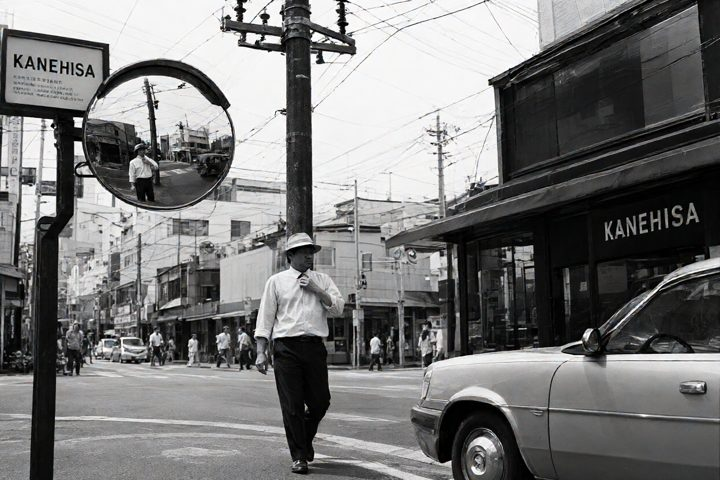<br><sub><code>photo</code> <i>&ldquo;a lamp post growing precisely out of a passer-by’s head&rdquo;</i></sub></td>
<td width="25%" valign="top">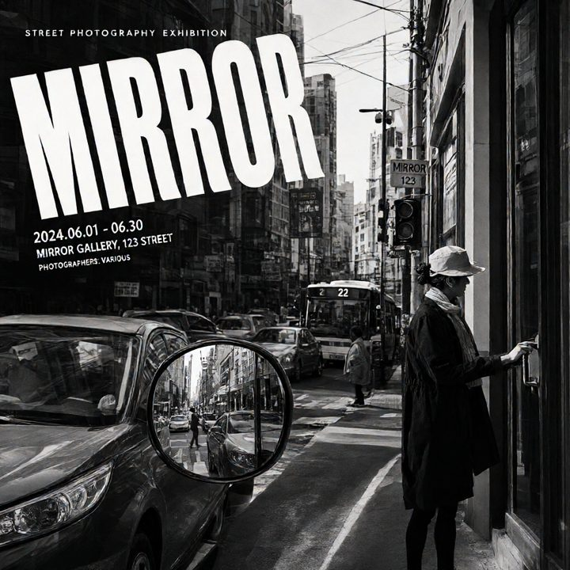<br><sub><code>poster</code> <i>&ldquo;a street-photography exhibition poster, layered reflections, slanted title “MIRROR”&rdquo;</i></sub></td>
<td width="25%" valign="top">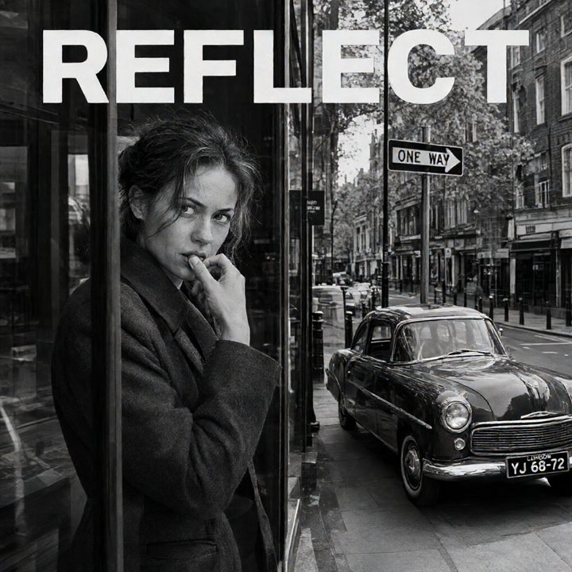<br><sub><code>poster</code> <i>&ldquo;a B&W photobook poster, a face sliced by a window frame, title “REFLECT”&rdquo;</i></sub></td>
</tr>
</table>

### Pale Light Moments

<table>
<tr>
<td width="25%" valign="top">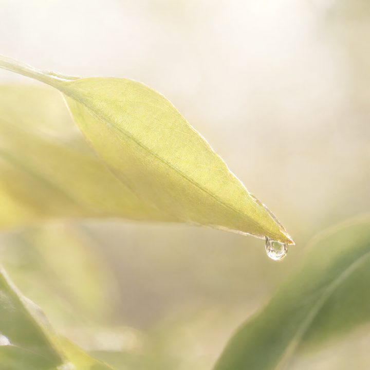<br><sub><code>photo</code> <i>&ldquo;a single trembling dew drop about to fall from a bright backlit leaf&rdquo;</i></sub></td>
<td width="25%" valign="top">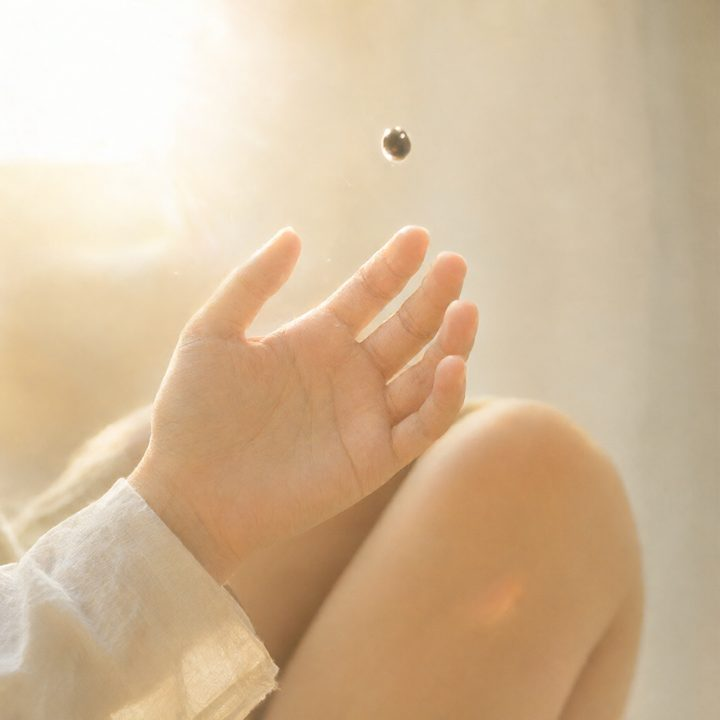<br><sub><code>photo</code> <i>&ldquo;a child’s small hand lifted into pale, near-overexposed morning light&rdquo;</i></sub></td>
<td width="25%" valign="top">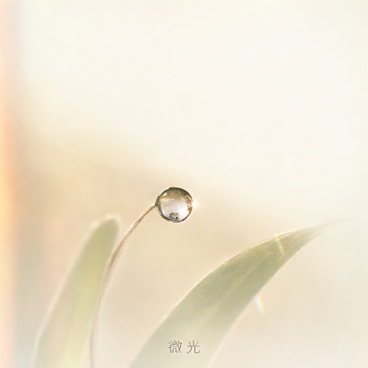<br><sub><code>poster</code> <i>&ldquo;a high-key photobook poster, a dew drop in blown-out morning light, title “Faint Light”&rdquo;</i></sub></td>
<td width="25%" valign="top">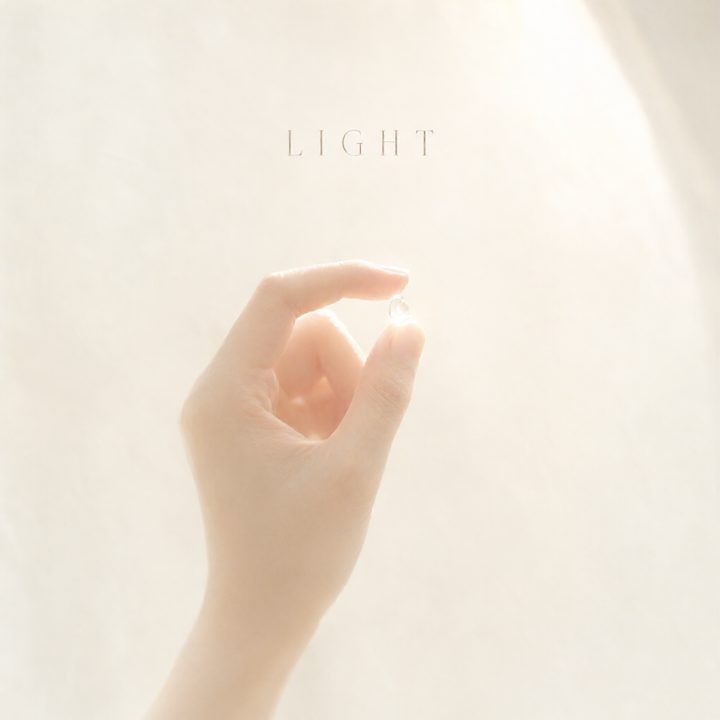<br><sub><code>poster</code> <i>&ldquo;a minimalist exhibition poster, a small hand in pale light, title “LIGHT”&rdquo;</i></sub></td>
</tr>
</table>

### Everyday Punchline

<table>
<tr>
<td width="25%" valign="top">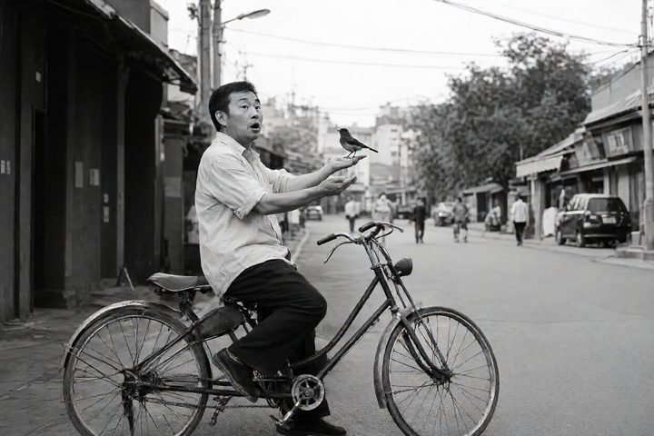<br><sub><code>photo</code> <i>&ldquo;a passer-by caught in an accidentally absurd pose&rdquo;</i></sub></td>
<td width="25%" valign="top">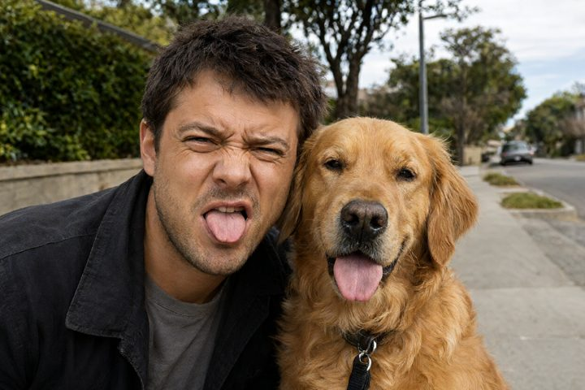<br><sub><code>photo</code> <i>&ldquo;a dog and its owner side by side wearing the exact same expression&rdquo;</i></sub></td>
<td width="25%" valign="top">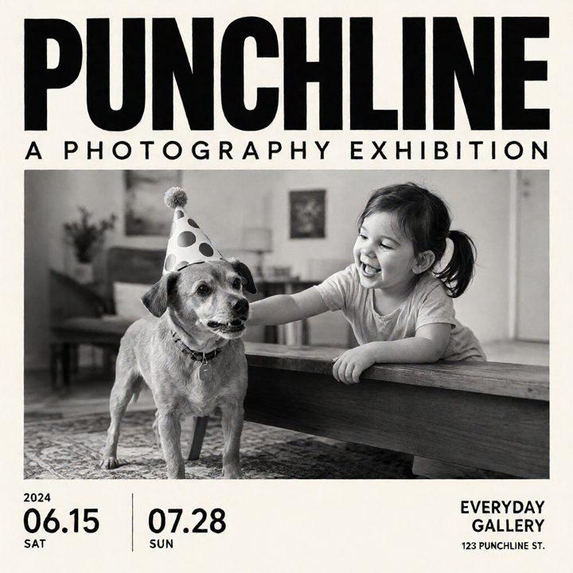<br><sub><code>poster</code> <i>&ldquo;a humour-photography exhibition poster, an absurd coincidence, title “PUNCHLINE”&rdquo;</i></sub></td>
<td width="25%" valign="top">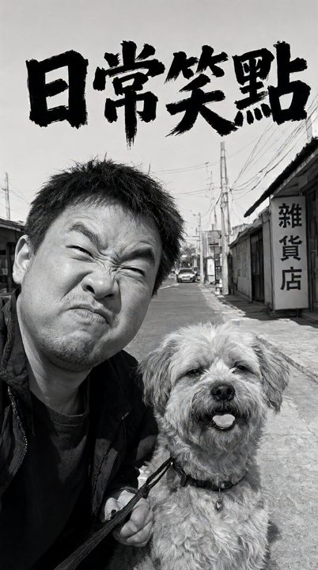<br><sub><code>poster</code> <i>&ldquo;a candid-life photobook poster, a dog and owner with matching faces, title “Everyday Punchline”&rdquo;</i></sub></td>
</tr>
</table>

### Vivid Garden

<table>
<tr>
<td width="25%" valign="top">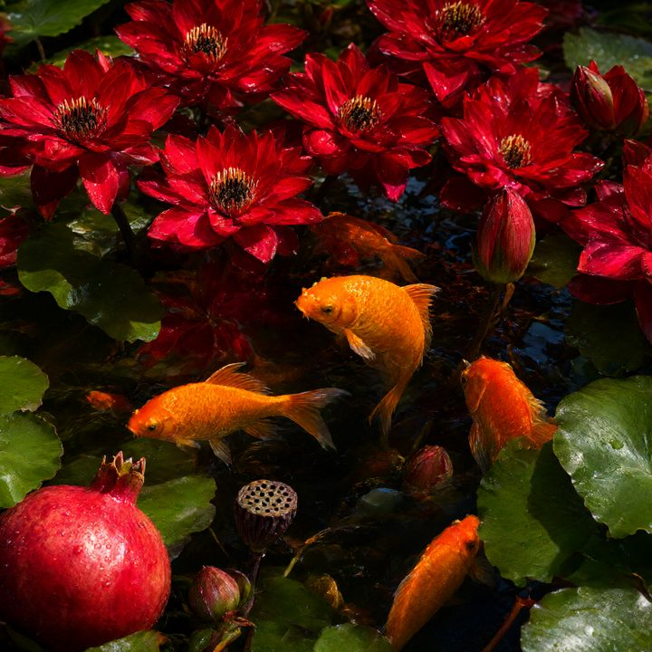<br><sub><code>photo</code> <i>&ldquo;a drowning-dense field of crimson and magenta blooms with goldfish gliding through&rdquo;</i></sub></td>
<td width="25%" valign="top">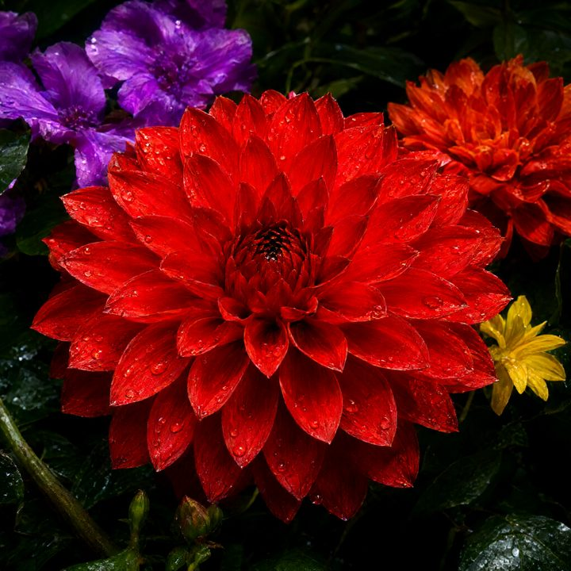<br><sub><code>photo</code> <i>&ldquo;a single red datura flower beaded with rain, saturated to the edge of too-much&rdquo;</i></sub></td>
<td width="25%" valign="top">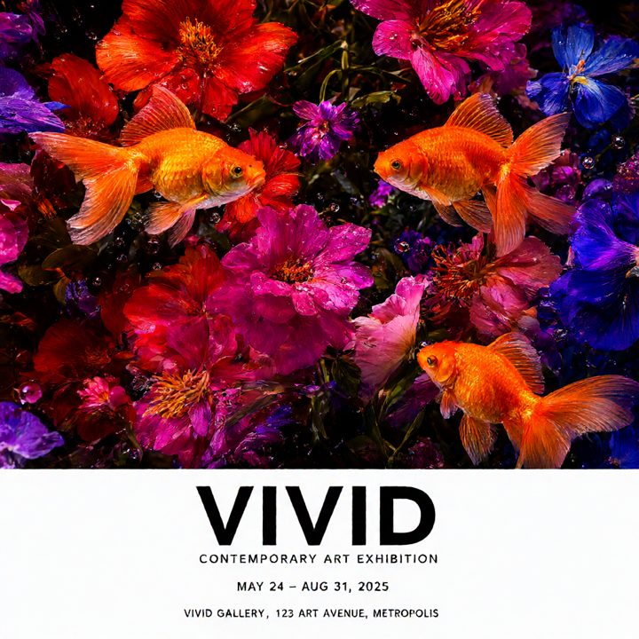<br><sub><code>poster</code> <i>&ldquo;a contemporary art poster, a full-bleed saturated flower field with goldfish, bold title “VIVID”&rdquo;</i></sub></td>
<td width="25%" valign="top">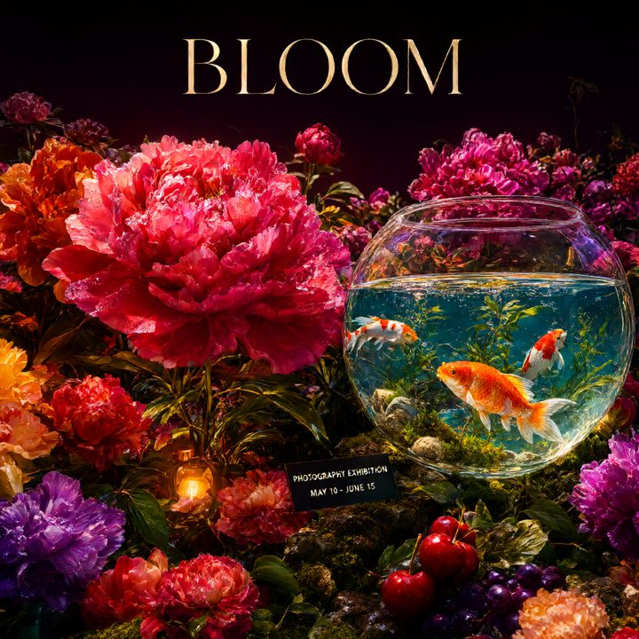<br><sub><code>poster</code> <i>&ldquo;a flower-photography poster, over-saturated peonies and a glowing goldfish bowl, title “BLOOM”&rdquo;</i></sub></td>
</tr>
</table>

### Playful Film

<table>
<tr>
<td width="25%" valign="top">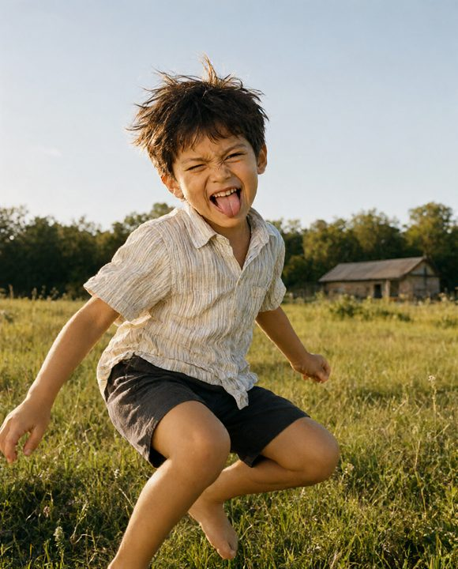<br><sub><code>photo</code> <i>&ldquo;a kid mid-goofy-face leaping through a sunlit field, hair flying&rdquo;</i></sub></td>
<td width="25%" valign="top">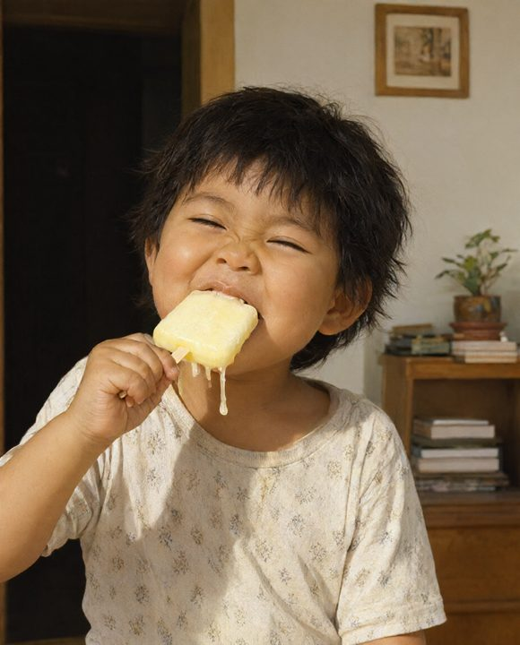<br><sub><code>photo</code> <i>&ldquo;a child laughing wide around a dripping popsicle&rdquo;</i></sub></td>
<td width="25%" valign="top">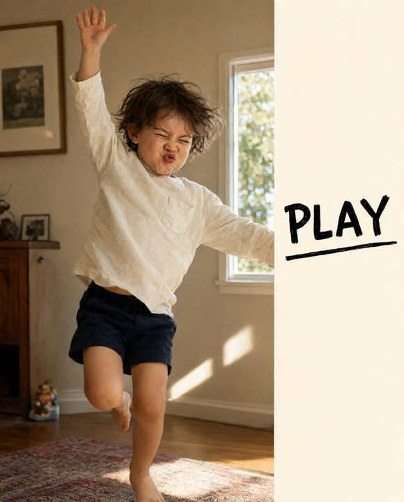<br><sub><code>poster</code> <i>&ldquo;a film-snapshot photobook poster, a kid leaping and pulling a face, title “PLAY”&rdquo;</i></sub></td>
<td width="25%" valign="top">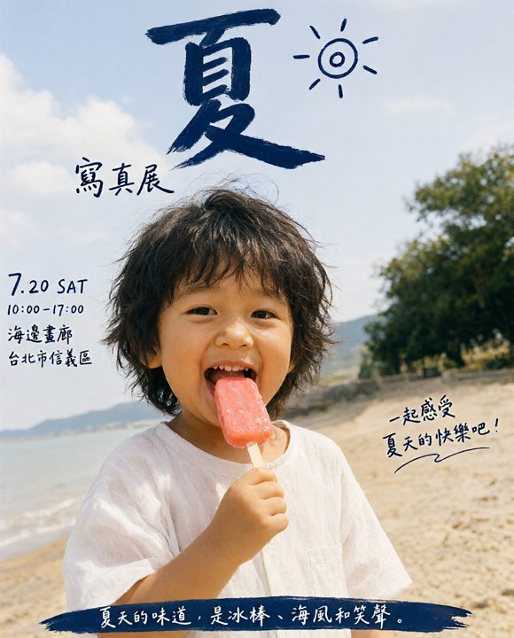<br><sub><code>poster</code> <i>&ldquo;a summer photo-show poster, a child laughing with a popsicle, title “Summer”&rdquo;</i></sub></td>
</tr>
</table>

## Requirements

1. A ComfyUI that can already run **Qwen-Image-2.1** (it provides `TextEncodeQwenImage21` and the
   UNet / CLIP / VAE loaders you use).
2. A running **PE-T2I rewriter** on an OpenAI-compatible `/v1/chat/completions` endpoint, serving
   `Qwen/Qwen-Image-2.1-PE-T2I` (any backend — vLLM, llama-server, LM Studio, ...; any weight
   format). Point the node's `endpoint` at it (default `http://127.0.0.1:8207`).

No Python dependencies to install.

## Install

```bash
cd ComfyUI/custom_nodes
git clone https://github.com/pottokao-dotcom/ComfyUI-QwenImage-PhotoStyles
```

Or install from the ComfyUI Registry via ComfyUI Manager (search "Qwen-Image Photo Styles").

## Inputs / Outputs

**Inputs** — `prompt` (multiline), `style` (dropdown: `None` + 17 styles), `endpoint`, `seed`,
`temperature`; optional `model`, `timeout_s`, `system_prompt_path`.

**Outputs** — `prompt` (STRING), `negative` (STRING), `width` (INT), `height` (INT),
`wh_ratio` (STRING). `seed` also picks one of the style's mood sub-presets, so re-rolling it
varies the feeling.

## The 17 styles

Black Fury · Geometry of Light · Warm Documentary · White Leap · Corner Elegance · Cold Power ·
Hyper Chic East · Private Diary · Color Behind Glass · Frozen Film Still · Fairytale Giants ·
Soft Everyday Light · Street in the Mirror · Pale Light Moments · Everyday Punchline ·
Vivid Garden · Playful Film.

Each style sheet in `styles/*.txt` specifies, per style: **Look, Lens language, Light, Emotion,
People, Scene & props, Colour**, plus per-style negatives and — for film-look styles — a fixed
grain clause.

## Models (optional — a ready-made low-VRAM family pack)

This node only needs the **PE-T2I rewriter**; everything else is your own Qwen-Image-2.1 graph.
If you want a self-quantized set to run the whole thing, here are 4-bit builds — **NVFP4** for
NVIDIA (ComfyUI / vLLM) and **GGUF Q4** for Mac / low-VRAM (llama.cpp / ComfyUI-GGUF).
("Heretic" = an abliterated / decensored build.)

| Component | NVFP4 · NVIDIA | GGUF Q4 · Mac |
|---|---|---|
| **PE-T2I rewriter** (this node calls) | [NVFP4](https://huggingface.co/pottokao/Qwen-Image-2.1-PE-T2I-Heretic-NVFP4) | [GGUF](https://huggingface.co/pottokao/Qwen-Image-2.1-PE-T2I-Heretic-GGUF) |
| **DiT** (image model) | [NVFP4](https://huggingface.co/pottokao/Qwen-Image-2.1-DiT-NVFP4-ComfyUI) | [GGUF](https://huggingface.co/pottokao/Qwen-Image-2.1-DiT-GGUF) |
| **Text encoder** (Qwen3-VL) | [NVFP4](https://huggingface.co/pottokao/Qwen-Image-2.1-Text-Encoder-Heretic-NVFP4) | [GGUF](https://huggingface.co/pottokao/Qwen-Image-2.1-Text-Encoder-Heretic-GGUF) |

Direct links:

- PE-T2I rewriter — NVFP4: https://huggingface.co/pottokao/Qwen-Image-2.1-PE-T2I-Heretic-NVFP4 · GGUF: https://huggingface.co/pottokao/Qwen-Image-2.1-PE-T2I-Heretic-GGUF
- DiT — NVFP4: https://huggingface.co/pottokao/Qwen-Image-2.1-DiT-NVFP4-ComfyUI · GGUF: https://huggingface.co/pottokao/Qwen-Image-2.1-DiT-GGUF
- Text encoder — NVFP4: https://huggingface.co/pottokao/Qwen-Image-2.1-Text-Encoder-Heretic-NVFP4 · GGUF: https://huggingface.co/pottokao/Qwen-Image-2.1-Text-Encoder-Heretic-GGUF

The Qwen3-VL text-encoder **GGUF** needs this add-on in ComfyUI (fixes the 12288 shape error):
https://github.com/pottokao-dotcom/ComfyUI-GGUF-Qwen3VL-TE

## Example

See `example_workflow_api.json` (API format — enable *Dev mode* in ComfyUI settings, then
*Load (API Format)*). The loader nodes and model file names there are just an example; swap in
whatever Qwen-Image-2.1 models and format you use.

## Licensing

- Node code, style sheets, `presets.json`, docs — **MIT** (see `LICENSE`).
- `style_sp_plus.txt` is adapted from Qwen's official Qwen-Image-2.1-PE-T2I system prompt and
  remains under the **Qwen Research License** (see `NOTICE`). Review it before commercial use.
